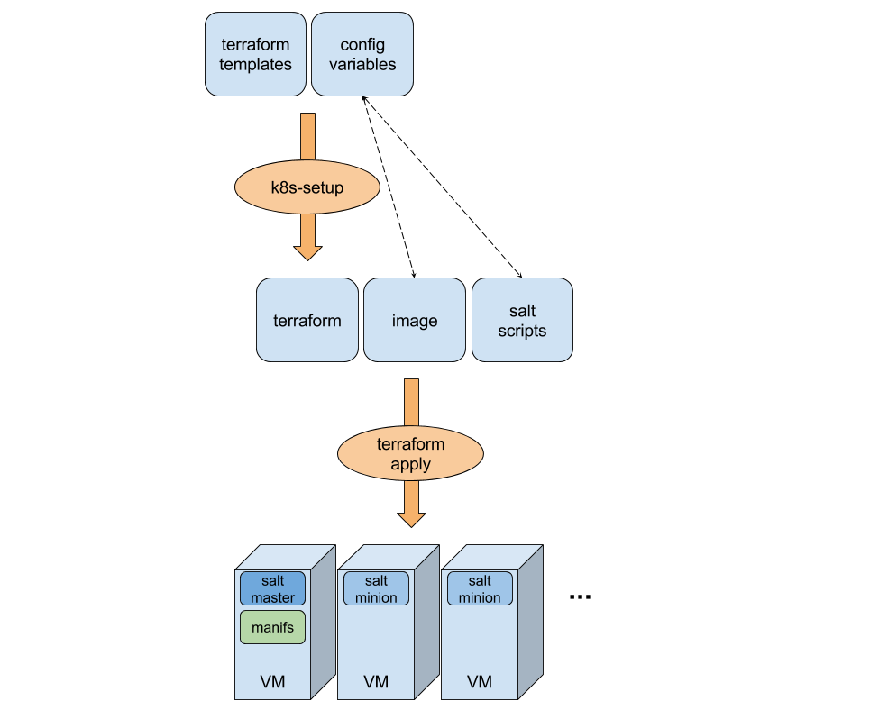

# Terraform provisioning for Kubernetes

This project includes [Terraform](https://www.terraform.io) scripts for
deploying Kubernetes on top of [OpenStack](https://www.openstack.org/)
or [libvirt](http://libvirt.org/).

The whole process can be seen in this diagram:

We use [Terraform](https://www.terraform.io/) for creating VMs that
will be provisioned with [Salt](https://saltstack.com/) later on.
However, we do not use vanilla Terraform scripts but [some templates](terraform)
that are processed by our `k8s-setup` script (our own preprocessor
that internally uses [erb](https://apidock.com/ruby/ERB)). This process
can be controlled with some [configuration variables](docs/terraform.md#configuration-variables)
that can be used for specifying things like the VMs base image, the Salt scripts
directory, the number of worker nodes, etc

You can find more information about how to use this code in the
following links:

 * [Requirements](docs/requirements.md): the packages and images required.
 * [Terraform files generation](docs/terraform.md): how to generate Terraform scripts.
 * [Cluster creation](docs/apply.md): creating the cluster with `terraform apply`
 * [Salt orchestration](docs/salt.md): provisioning the VMs.
 * [Using the Kubernetes cluster](docs/usage.md)

## License

This project is licensed under the Apache License, Version 2.0. See
[LICENSE](https://github.com/kubic-project/salt/blob/master/LICENSE) for the full
license text.
