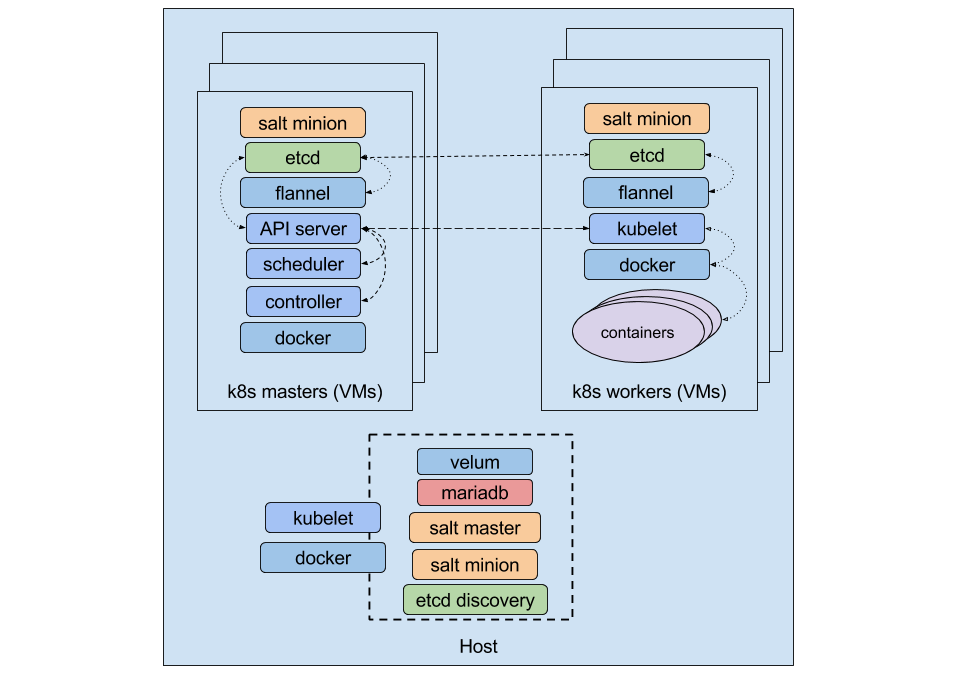

# Terraform files generation

## `k8s-setup` script

The Kubernetes infrastructure is managed with _Terraform_, but
we use a ruby script, `k8s-setup`, for preprocessing the
Terraform templates, replacing variables and conditionally
including code.

This script processes all the `*.tf` and `*.tf.erb` files
found in the _terraform directory_ (by default, `$(pwd)/terraform`)
and generates a unique output file (by default, `k8s-setup.tf`). As a
shortcut, it also runs `terraform` with the last arguments provided,
so running `k8-setup plan` is equivalent to `k8s-setup && terraform plan`.

## Configuration Variables

Some aspects of the cluster can be configured by using variables.
These variables can be provided to the `k8s-setup` script
with `-V variable=value` arguments, or through a _profile
file_ (a file with variables assignments).

See the `*.profile`  provided in the repository for more details, as well
as for some variables used in our templates.

### Main variables

  * `salt_dir`

    The directory where the Salt scripts are (`/usr/share/salt/kubernetes`
    when installing the `kubernetes-salt` RPM, or a checkout of [this
    repo](https://github.com/kubic-project/salt))

  * `ssh_key`

    `ssh_key` is the key we will use for accessing machines (by default,
    the `id_docker` in the local `ssh` directory)

  * `cluster_prefix`

    By default all the VMs provisioned by Terraform are going to be named in the
    same way (eg: `kube-master`, `kube-minion1`, `kube-minion2`,...). This makes
    impossible for multiple people to deploy a Kubernetes cluster on the same cloud.

    This can be solved by setting the `cluster_prefix` variable to something like
    `flavio-`.

  * `cluster_domain_name`

    The cluster default domain name. It can be something like `k8s.local`. This
    domain name will be used across all the instances.

  * `kube_minions_size`

    By default the k8s cluster has 3 k8s minions. However it's possible to
    change the default value by using the `kube_minions_size` variable.

  * `bridge`

    Name of the bridge interface to use when creating the nodes. This is useful
    when the libvirt host is a remote machine different from the one running
    terraform.

  * `<component name>_memory`

    The amount of memory to be assigned to the given component in MB. Possible
    options for components are: `master`, `minion` and `dashboard`. The default value
    is 512 MB. Moreover, if you want to setup the same value for all of them,
    you can use the `memory` shortcut. **Note**: this only works for the libvirt
    setup. Support for openstack is still being worked.

  * `<component name>_cpus`

    The number of vcpus to be assigned to the given component. Possible
    options for components are: `master`, `minion` and `dashboard`. The default value
    is 1. Moreover, if you want to setup the same value for all of them,
    you can use the `memory` shortcut. **Note**: this only works for the libvirt
    setup. Support for openstack is still being worked.

  * `docker_reg`

    An (optional) Docker registry (ie, `myserver:5000`). This can be
    specially helpful when you intend to download many Docker images and
    bandwidth is scarce.


### Controlling the Cluster created

There are some special variables that are used for controlling
the environment that will be created by Terraform.

  * `skip_dashboard`

    Do not try to create a Dashboard machine.

  * `skip_role_assignments`

    Do not try to assign roles to machines from Terraform. By default, we
    create one kubernetes master and `kube_minions_size` minions, and
    we assign the role to those VMs by seting a `grain` from some
    [scripts](../provision). By setting this variable we will skip this
    role assignment.

These two variables can be used for creating a
[development environment](https://github.com/kubic-project/velum#development):.



In this kind of environment, we skip the _Administration Dasboard_ creation
and use the _host_ for running the services started there. We use a local
`kubelet` for launching `mariadb`, the Salt master and a minion, etc.
Terraform will be used for spawning machines with no role assigned
where a Salt minion is configured for connecting to the Salt master
in the _host_. This Salt master - as well as the Velum application -
can be configured for using scripts located in the host, making things
easier for development.

### Settings for CaaSP

You can try the _CaaSP_/_MicroOS_ images with the help of the
[`libvirt-caasp.profile`](../libvirt-caasp.profile) profile. You can then
run something similar to:

```
$ cd terraform && ./k8s-setup -v \
    -F libvirt-caasp.profile \
    -V salt_dir=`pwd`/k8s-salt \
    -V ssh_key=`pwd`/ssh/id_docker \
    -V volume_pool=personal \
    -V kube_minions_size=2 \
    -V cluster_prefix=caasp \
    -V net_cidr=10.17.15.0/24 \
    fmt
```

Make sure the `volume_source` in the profile points to a valid image URL.

You must take into account that the environment created is similar but
not the same as a real _CaaSP_/_MicroOS_ cluster. For example, some
things are already installed in the _CaaSP_/_MicroOS_ images (like the
Salt scripts) while the Terraform code here insists on copying stuff to
the VMs. That forces us to use some specific manifest files (i.e., for
the Salt master) that mount the files we are copying instead of the
files already present in the image.

## Helper script for libvirt

You should be using the `k8s-setup` script to manage your Kubernetes
cluster. That being said, if you are going to use the `libvirt` driver, you
might want to take a look at the
[k8s-libvirt](../contrib/libvirt/k8s-libvirt.sh) script. This script
assumes that you want to use libvirt, and it makes some
assumptions that will allow you to deploy your cluster with a simple command.

